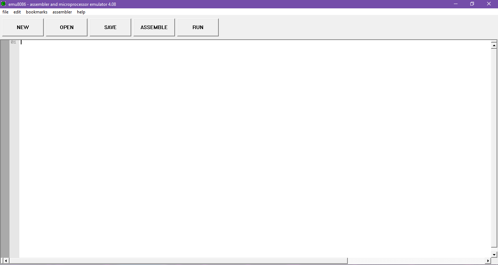

## Name of the Application used: EMU8086 - MICROPROCESSOR EMULATOR

<!--  -->
</img>

### Where the app was downloaded, click: [EMU8086](https://emu8086-microprocessor-emulator.en.softonic.com/download)

###  Basic way to use it:

- Open the App.

</img>

- Input your code.

</img>

- Click the "RUN" button. And two window forms will show up. Just click again the "run" button on the big window to execute the program.

https://github.com/user-attachments/assets/f43699b3-5c9d-40f6-b60a-a3593def081e

- Can also run the program per line by just clicking the "single step" button.

https://github.com/user-attachments/assets/cb5457b3-4f91-471a-8112-e3db7bdf641e

